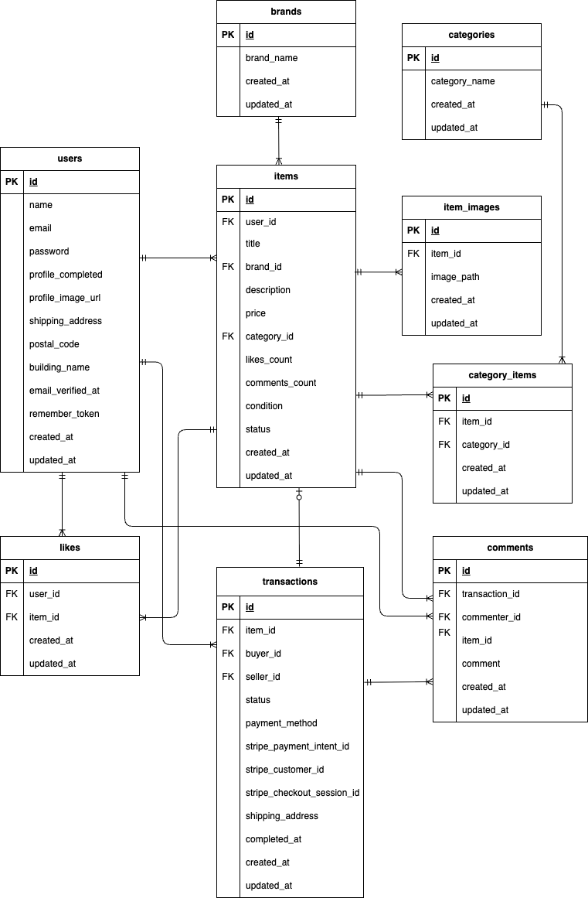

# coachtechフリマ
    coachtechフリマ は、ある企業が開発を計画しているフリマアプリです。
    10〜30代の社会人を主なターゲットに、アイテムの出品・購入ができるシンプルで使いやすいサービスを目指しています。
    初年度ユーザー数1,000人の達成を目標に、設計・コーディング・テストまでを一貫して担当します。

    本プロジェクトは、Laravelを用いたWebアプリケーション開発の模擬案件として取り組んでおり、
    一人で設計から実装、テストまでを行い、実務に近い開発プロセスの体験を目的としています。

## プロジェクトの概要


## 環境構築手順
**Dockerビルド**
1. GitHubからプロジェクトをクローン
    `git@github.com:S185900/flea-market-app.git`
2. プロジェクトディレクトリに移動
    `cd flea-market-app`
3. (初回のみ)MySQL用の空ディレクトリを作成
    `mkdir -p docker/mysql/data`
4. DockerDesktopアプリを立ち上げる
5. Dockerコンテナをビルド＆起動
    `docker-compose up -d --build`

> *MacのM1・M2チップのPCの場合、`no matching manifest for linux/arm64/v8 in the manifest list entries`のメッセージが表示されビルドができないことがあります。エラーが発生する場合は、docker-compose.ymlファイルの「mysql」内に「platform」の項目を追加で記載してください*

``` bash
mysql:
    platform: linux/x86_64 # ← この行を追加
    image: mysql:8.0.26
    environment:
```

**Laravel環境構築**
1. PHPコンテナに入る
    `docker-compose exec php bash`
2. Laravelパッケージをインストール
    `composer install`
3. .env.example をコピーして .env を作成。※(または、新しく.envファイルを作成でもOK)
    `cp .env.example .env`
4. .env に以下の環境変数を追加/記載があるか確認
``` text
# DB設定
DB_CONNECTION=mysql
DB_HOST=mysql
DB_PORT=3306
DB_DATABASE=laravel_db
DB_USERNAME=laravel_user
DB_PASSWORD=laravel_pass

# Fortify（セッションドライバ）
SESSION_DRIVER=file

# Stripe（テスト用APIキー）※キーの取得方法は下記に記載
STRIPE_KEY=(あなたの公開キー)
STRIPE_SECRET=(あなたの秘密キー)

# Mailhog（ローカルメール送信）※メール受信画面は下記に記載
MAIL_MAILER=smtp
MAIL_HOST=mailhog
MAIL_PORT=1025
MAIL_USERNAME=null
MAIL_PASSWORD=null
MAIL_ENCRYPTION=null
MAIL_FROM_ADDRESS=no-reply@example.test # Mailhog用の仮アドレス
MAIL_FROM_NAME="${APP_NAME}"
```
> *Mailhog（メール送信確認）について：Mailhogは、ローカル環境でメール送信を確認するためのツールです。 アカウント登録などは不要で、Docker起動時に自動で立ち上がります。ブラウザで http://localhost:8025 にアクセスします。Laravelから送信されたメール（認証・パスワードリセットなど）が一覧表示されます。*

> *Stripe（テスト用APIキー）について：このプロジェクトでは、Stripeを使ったクレジットカード決済機能とコンビニ決済機能を実装しています。APIキーは各自のStripeアカウントで取得してください。[Stripe公式サイト](https://dashboard.stripe.com/register)でアカウントを作成（無料）し、テスト用APIキーを取得してください。*

5. アプリケーションキーの作成
``` bash
php artisan key:generate
```

6. マイグレーションの実行
``` bash
php artisan migrate
```

7. シーディングの実行
``` bash
php artisan db:seed --class=UserSeeder
php artisan db:seed --class=CategorySeeder
php artisan db:seed --class=BrandSeeder
php artisan db:seed --class=CustomProductSeeder
```
8. シンボリックリンク作成
``` bash
php artisan storage:link
```

## 使用技術
- PHP 8.1.33
- Laravel 8.83.8
- MySQL　8.0.26
- Laravel Fortify（ユーザー認証）
- Stripe（テスト決済）
- Mailhog（メール送信確認）
- Docker / Docker Compose

## 管理者ユーザーおよび一般ユーザーのログイン情報
| ユーザー種別     | メールアドレス         | パスワード     |
|------------------|--------------------------|----------------|
| 管理者ユーザー   | admin@example.com         | password123    |
| 一般ユーザー     | user@example.com          | password123    |
| ダミーユーザー（10名） | Factoryで自動生成されたメールアドレス | password123    |

> *指定された商品データを登録するにあたり、**出品者としてのダミーユーザーを事前に登録しています**。登録フォームから作成されたユーザーは、入力したパスワードでログインしてください。*

## ER図



## URL
- 開発環境：http://localhost/
- phpMyAdmin:：http://localhost:8080/
- Mailhog： http://localhost:8025/

## 補足
**Laravel Fortify（認証機能）**
- ログイン・登録・パスワードリセット機能を Fortify で実装
- 一部の機能はオーバーライドしてカスタマイズされています。
- FortifyServiceProviderの登録について：config/app.php の providers 配列にApp\Providers\FortifyServiceProvider::class が含まれているかどうか確認してください。
- Fortifyの設定について：config/fortify.php が存在していることを確認してください。

**Stripe（テスト決済）**
- クレジットカード・コンビニ決済に対応
- テスト用APIキーは各自のStripeアカウントから取得