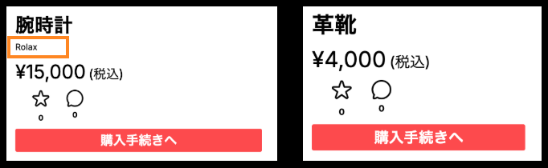

# coachtechフリマ

## プロジェクトの概要
    coachtechフリマ は、ある企業が開発した独自のフリマアプリです。10〜30代の社会人を主なターゲットに、アイテムの出品・購入ができるシンプルで使いやすいサービスを目指しています。

    初年度ユーザー数1,000人の達成を目標に、設計・コーディング・テストまでを一貫して担当します。

    (本プロジェクトは、Laravelを用いたWebアプリケーション開発の模擬案件として取り組んでおり、
     一人で設計から実装、テストまでを行い、実務に近い開発プロセスの体験を目的としています。)

## 環境構築手順
**Dockerビルド**
1. GitHubからプロジェクトをクローン ※SSH接続でクローンする場合は、事前にGitHubにSSH鍵を登録しておいてください。
```bash
    git clone git@github.com:S185900/flea-market-app.git
```
2. プロジェクトディレクトリに移動
```bash
    cd flea-market-app
```
3. (初回のみ)MySQL用の空ディレクトリを作成 ※Dockerビルドの際のエラー回避のため
```bash
    mkdir -p docker/mysql/data
```
4. DockerDesktopアプリを立ち上げる
5. Dockerコンテナをビルド＆起動
```bash
    docker-compose up -d --build
```

> *MacのM1・M2チップのPCの場合、`no matching manifest for linux/arm64/v8 in the manifest list entries`のメッセージが表示されビルドができないことがあります。エラーが発生する場合は、docker-compose.ymlファイルの「mysql」内に「platform」の項目を追加で記載してください*

``` bash
mysql:
    platform: linux/x86_64 # ← この行を追加
    image: mysql:8.0.26
    environment:
```

**Laravel環境構築**
1. PHPコンテナに入る
```bash
    docker-compose exec php bash
```

2. Laravelパッケージをインストール
```bash
    composer install
```

> *composer install 実行時に表示されるパッケージに関する注意について：　このプロジェクトでは、fruitcake/laravel-cors および swiftmailer/swiftmailer のパッケージを使用しています。composer install 実行時に、これらが非推奨（abandoned）である旨のメッセージが表示されますが、現時点では動作に問題はありません。今後のLaravelのバージョンアップやセキュリティ対応を見据えて、必要に応じて代替手段への移行を検討することも可能です。*

3. .env.example をコピーして .env を作成。または、新しく.envファイルを作成。
```bash
cd flea-market-app
cd src
cp .env.example .env
```

4. .env に以下の環境変数を追加(一部、記載があるか確認も行う)
``` text
# DB設定
DB_CONNECTION=mysql
DB_HOST=mysql
DB_PORT=3306
DB_DATABASE=laravel_db
DB_USERNAME=laravel_user
DB_PASSWORD=laravel_pass

# Fortify（セッションドライバ）があるかどうか確認を行う
SESSION_DRIVER=file

# Mailhog（ローカルメール送信）※メール受信画面については後ほど詳しく紹介しています
MAIL_MAILER=smtp
MAIL_HOST=mailhog
MAIL_PORT=1025
MAIL_USERNAME=null
MAIL_PASSWORD=null
MAIL_ENCRYPTION=null
MAIL_FROM_ADDRESS=no-reply@example.test # Mailhog用の仮アドレス
MAIL_FROM_NAME="${APP_NAME}"

# Stripe（テスト用APIキー）※キーの取得方法は後ほど詳しく紹介しています
STRIPE_KEY=(あなたの公開キー)
STRIPE_SECRET=(あなたの秘密キー)
```
> *Mailhog（メール送信確認）について：Mailhogは、ローカル環境でメール送信を確認するためのツールです。 アカウント登録などは不要で、Docker起動時に自動で立ち上がります。ブラウザで http://localhost:8025 にアクセスします。Laravelから送信されたメール（認証・パスワードリセットなど）が一覧表示されます。*

> *Stripe（テスト用APIキー）について：このプロジェクトでは、Stripeを使ったクレジットカード決済機能とコンビニ決済機能を実装しています。APIキーは各自のStripeアカウントで取得してください。[Stripe公式サイト](https://dashboard.stripe.com/register)でアカウントを作成（無料）し、テスト用APIキーを取得してください。*

5. アプリケーションキーの作成
``` bash
php artisan key:generate
```

6. キャッシュクリア
``` bash
php artisan config:clear
php artisan cache:clear
```

7. シンボリックリンク作成
``` bash
php artisan storage:link
```

8. マイグレーションの実行
``` bash
php artisan migrate
```

9. シーディングの実行
``` bash
php artisan db:seed --class=UserSeeder
php artisan db:seed --class=CategorySeeder
php artisan db:seed --class=BrandSeeder
php artisan db:seed --class=CustomProductSeeder
```

## 使用技術
- PHP 8.1.33
- Laravel 8.83.8
- MySQL　8.0.26
- Laravel Fortify（ユーザー認証）
- Stripe（テスト決済）
- Mailhog（メール送信確認）
- Docker / Docker Compose

## 管理者ユーザーおよび一般ユーザーのログイン情報
| ユーザー種別     | メールアドレス         | パスワード     |
|------------------|--------------------------|----------------|
| 管理者ユーザー   | admin@example.com         | password123    |
| 一般ユーザー     | user@example.com          | password123    |
| ダミーユーザー（10名） | Factoryで自動生成されたメールアドレス | password123    |

> *指定された商品データを登録するにあたり、**出品者としてのダミーユーザーを事前に登録しています**。(登録フォームから作成されたユーザーは、入力したパスワードでログインしてください。)*

## ER図


## URL
- 開発環境：http://localhost/
- phpMyAdmin:：http://localhost:8080/
- Mailhog： http://localhost:8025/

## 基本設計書(スプレッドシート)
https://docs.google.com/spreadsheets/d/1Ddjn-eNxOvM6Xl4XyfeVJRT20usvDEk4t38bq1XBjHo/edit?gid=323216768#gid=323216768&range=A1

## テーブル仕様書(スプレッドシート)
https://docs.google.com/spreadsheets/d/1Ddjn-eNxOvM6Xl4XyfeVJRT20usvDEk4t38bq1XBjHo/edit?gid=1188247583#gid=1188247583&range=A1

## 補足

**Laravel Fortify（認証機能）**
- このプロジェクトでは Laravel Fortify を使用しています。必要な設定・インストールはすでに完了しているため、追加のインストール作業は不要です。.env の SESSION_DRIVER 設定が正しくされていれば、そのままご利用いただけます。
- 一部の機能はオーバーライドしてカスタマイズされています。

**Stripe（テスト決済）**
- クレジットカード・コンビニ決済に対応
- テスト用APIキーは各自のStripeアカウントから取得

**メール認証誘導画面**
- 一部要件に基づき、「認証はこちらから」ボタンを押下すると、メール認証サイト:MailHog http://localhost:8025/ が別タブで表示されるように設定されています。
- MailHogで直近に届いたメールを開き「Verify Email Address」ボタンをクリックすると、プロフィール設定画面(初回)が別タブで開きます。
```
＜要件より抜粋＞
1. メール認証導線画面を表示する
2. 「認証はこちらから」ボタンを押下
3. メール認証サイトを表示する
```

**商品購入画面**
- 一部要件に基づき、「購入する」ボタンを押下すると、Stripeの決済画面に接続 https://checkout.stripe.com/... (別タブで表示)されるように設定されています。
- 購入完了後、元のページは商品一覧画面にリダイレクトされ、購入済みの商品画像には「Sold」ラベルが表示されます。
```
＜要件より抜粋＞
1.「購入する」ボタンを押下すると購入が完了するか
2. 購入した商品は商品一覧画面にて""sold""と表示されているか
3. 「プロフィール/購入した商品一覧」に追加されているか
4. 商品を購入した後の遷移先は商品一覧画面になっているか

1. プルダウンメニューから方法を選択できる
    1. コンビニ支払い
    2. カード支払い
2. 小計画面で変更が反映される
3. 「コンビニ支払い」並びに「カード支払い」を選択して，
　「購入する」ボタンを押下した際にstripeの決済画面に接続される
```

**売り切れの表示方法**
- 要件には「Sold」および「sold」の2通りの記載がございましたが、視認性を考慮し、ビュー上に表示される文言については「Sold」（先頭大文字）に統一しております。一方で、コード内の記述については「sold」（小文字）を使用している箇所もございます。
- プロフィール画面につきましては、「sold」および「Sold」の表示に関するご指示が確認できなかったため、現時点ではビュー上への表示は行っておりません。

**ブランド名の表示方法**
- ブランド名の有無に応じて表示を制御しています。設定されている場合は表示され、未設定の場合は非表示となります。(下記参照)


**出品金額のバリデーションについて**
- ExhibitionRequest.php にて、商品価格のバリデーションを以下のように設定しています。
- 要件「0円以上」に基づき、0円は許容、マイナス値（-1円以下）は不可としています。「0円以上」の表現が「1円以上」を意図している可能性もあるため補足させていただきました。

**PHPUnitによるテストについて**
- テスト実行コード一覧
``` bash
#1 会員登録機能
vendor/bin/phpunit tests/Feature/RegisterTest.php

#2 ログイン機能
vendor/bin/phpunit tests/Feature/LoginTest.php

#3 ログアウト機能
vendor/bin/phpunit tests/Feature/LogoutTest.php

#4 商品一覧取得
vendor/bin/phpunit tests/Feature/ItemsIndexTest.php

#5 マイリスト一覧取得
vendor/bin/phpunit tests/Feature/MyListTest.php

#6 商品検索機能
vendor/bin/phpunit tests/Feature/HeaderSearchTest.php

#7 商品詳細情報取得
vendor/bin/phpunit tests/Feature/ItemShowTest.php

#8 いいね機能
vendor/bin/phpunit tests/Feature/LikeTest.php

#9 コメント送信機能
vendor/bin/phpunit tests/Feature/CommentTest.php

#10 商品購入機能
vendor/bin/phpunit tests/Feature/PurchaseTest.php

#11 支払い方法選択機能
vendor/bin/phpunit tests/Feature/PaymentMethodSelectorTest.php

#12 配送先変更機能
vendor/bin/phpunit tests/Feature/AddressEditTest.php

#13 ユーザー情報取得
vendor/bin/phpunit tests/Feature/GetUserProfileTest.php

#14 ユーザー情報変更
vendor/bin/phpunit tests/Feature/UpdateUserProfileTest.php

#15 出品商品情報登録
vendor/bin/phpunit tests/Feature/SellTest.php

#16 メール認証機能
vendor/bin/phpunit tests/Feature/EmailVerificationFlowTest.php
```
